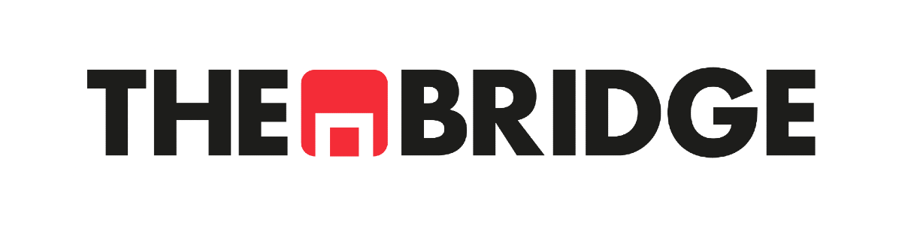

# **Data Science Online Madrid Septiembre 2025 - Abril 2026**
  - [**Descripción**](#descripción)
  - [**Comentarios y Aclaraciones**](#comentarios-y-aclaraciones)
  - [**Clonar y Actualizar Repositorio con Git Bash**](#clonar-y-actualizar-repositorio-con-Git-Bash)

**Descripción**
---

Bienvenid@s al repositorio principal del Bootcamp Online de Data Science de The Bridge.

El repositorio se divide en los siguientes módulos principales:

1. Programación Básica
2. Herramientas Avanzadas
3. Data Analysis
4. Machine Learning
5. Deep Learning
6. Data Engineering

¡Comenzamos!

**Comentarios y Aclaraciones**
---

El repositorio se irá actualizando a medida que avancemos en el Bootcamp, incorporando los materiales de los diferentes módulos, agrupados en sprints y unidades.  

Siguiendo esta filosofía, los sprints se abrirán de forma sincronizada con el Campus Virtual, según las fechas de apertura indicadas en el calendario del Bootcamp.

**Clonar y Actualizar Repositorio con Git Bash**
---

1. Moverse a la carpeta local en la que deseamos clonar el repo. Por ejemplo: 
`
cd Documents/GitHub
`
2. Abrir Git Bash en ese directorio.
3. Clonar el repositorio con
`
git clone https://github.com/ds-online-tb/DS-Online.git
`
4. Hacer `git pull` para actualizar.

